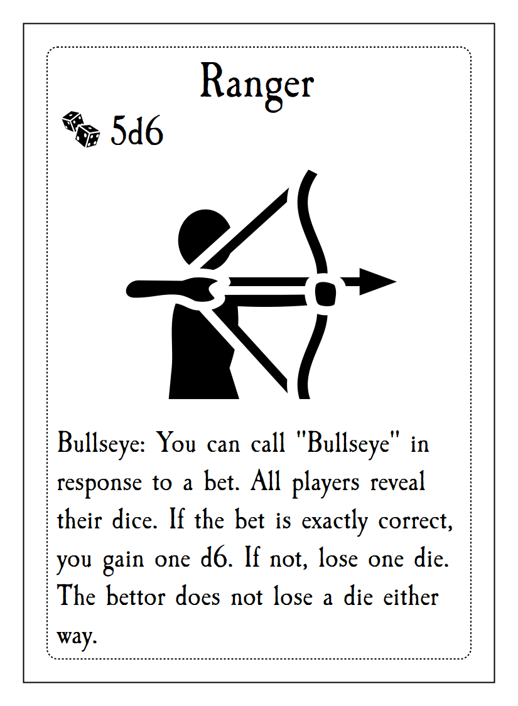
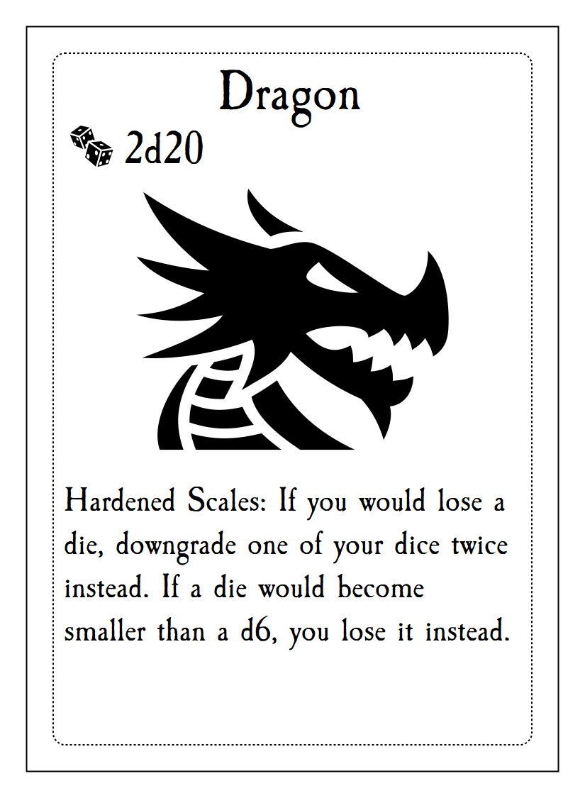

# Trickster's Tavern

## Overview

Hello! Trickster's Tavern is a liars-dice-like game that is currently under development.

This repo contains the playtest cards needed to play the game as well as the code to produce them.

## How to Play

The [_output](https://github.com/DarwinJones/tricksters_tavern/tree/main/_output) folder contains:

1. [A print and play sheet](https://github.com/DarwinJones/tricksters_tavern/blob/main/_output/sheet.pdf)
2. PNG versions of class cards you can pull up on your phone when playing

## Quick Play

1. Players each choose a class card and gather the dice detailed on the card.
2. Players roll their dice and hide them from other players.
3. The starting player makes a bet on the amount of dice of a certain value at the table (e.g. at least 2 fours, at least 1 one).
4. Players take turns making escalating bets until someone calls the previous bettor a ***Liar***
5. Once ***Liar*** is called, all players reveal their dice.
	1. If the last bet was true, the challenger loses the round. If not, the bettor loses the round.
	2. The losing player loses a die - becoming eliminated when they lose their last one.
6. After a round ends, the player who lost that round starts a new round of betting.
7. The last player with at least 1 die wins!

See [RULES.md](https://github.com/DarwinJones/tricksters_tavern/blob/main/RULES.md) for the full rule set and details about the new systems we added to the game!

## New Additions!

### More Dice!

In addition to standard 6-sided dice, this game uses coins as well as 4, 8, 10, 12, and 20-sided dice. TTRPG players rejoice that they finally have another use for their dice collections! 

### Characters/Classes

Players take on the roles of adventurers with different starting dice sets and abilities.

| Ranger | Blacksmith | Dragon |
|---|---|---|
|  |  |  |

### Power Cards [WIP]

Gain the upper hand by playing power cards which can help you or hinder your opponents.

### Field Effects [WIP]

Field effects change the rules of the game for all players and switch up the betting rules and risk-reward of the game

### Quests [VERY WIP]

Embark with the other players on adventures where you get to make choices and contend with traps, monsters, and each other!
